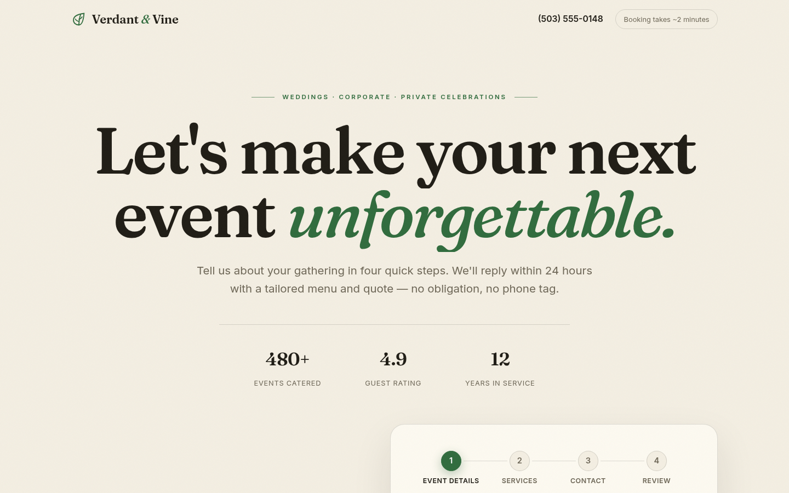

> **Live demo:** [https://verdant-vine-booking.vercel.app](https://verdant-vine-booking.vercel.app)



---

# Verdant & Vine — Multi-Step Catering Booking

A premium 4-step catering booking experience for a fictional high-end catering company, backed by a **validated Flask API**. Guests move through Event details → Services → Contact → Review, then get a booking reference number and a "what happens next" summary. Every booking is stored in `bookings.json`.


## For the client

**Turn event inquiries into confirmed bookings.** Instead of one intimidating form, your customers answer a few friendly questions per screen — date, guest count, service style (plated / buffet / stations / cocktail), add-ons, and contact details — with a progress indicator showing exactly where they are. Each step validates before they can continue, so you never get half-filled requests.

**Never lose a lead to a broken form.** Every field is checked instantly in the browser *and* re-checked on the server, so bad data can't slip through. Confirmed requests get a booking reference number (`BC-20260924-001`) and are saved automatically — nothing falls through the cracks. Swap in your own services, branding, and menu styles and it's ready for your site.

## The experience

1. **Event details** — date picker (no past dates), guest-count stepper (1–500), event type select
2. **Services** — selectable menu-style cards with icons, optional add-on checkboxes (bar service, rentals, cake…)
3. **Contact** — name, email, phone with real-time inline validation as you type
4. **Review** — full summary with "Edit" shortcuts back to any step, optional notes, then submit

Submit → animated success screen with the booking reference, a recap of the request, and what happens next (proposal within 24 hours → refine together → enjoy the day).

## Validation approach

**Client-side** (`static/app.js`) mirrors the server rules exactly, so feedback is instant:

- Required fields, email/phone regexes identical to the backend
- Event date must be after today; guests clamped to 1–500 via the stepper
- One menu style must be chosen; notes capped at 1,000 characters
- Per-step validation blocks "Continue" with friendly inline messages (`role="alert"`); completed steps stay clickable in the progress indicator to go back and fix things

**Server-side** (`app.py`) re-validates everything — client checks can be bypassed, server checks can't:

- `POST /api/bookings` returns `201` with `{"success": true, "reference": "BC-...", "message": "..."}`
- Returns `400` with `{"success": false, "errors": {"email": "...", ...}}` on bad data
- The frontend maps server errors back onto the right step and field automatically
- The catering-specific answers (event type, menu style, add-ons) are packed into the booking's `message` field; `service_type` is sent as `"Event Catering"` to satisfy the API contract

## Tech used

- **Python + Flask** — serves the page and the `POST /api/bookings` endpoint
- **Vanilla JavaScript** — step state machine, validation, `fetch()` submission, progress indicator
- **HTML5 + CSS** — Fraunces + Inter type pairing, responsive (390px → 1440px), semantic markup, ARIA step/error announcements, SEO + Open Graph meta, JSON-LD business schema
- **JSON file storage** — bookings appended to `bookings.json` with a reference number

## How to run

```bash
cd 07-booking-form
pip install -r requirements.txt
python3 app.py
```

Then open http://127.0.0.1:5007 in your browser.

### Try the API directly

```bash
# Valid booking
curl -X POST http://127.0.0.1:5007/api/bookings \
  -H "Content-Type: application/json" \
  -d '{"name":"Jordan Ellis","email":"jordan@example.com","phone":"555-123-4567","event_date":"2026-12-18","guests":12,"service_type":"Event Catering","message":"Event type: Wedding · Service style: Plated · Add-ons: Bar service"}'

# Invalid booking (bad email, past date) — returns 400 with field-level errors
curl -X POST http://127.0.0.1:5007/api/bookings \
  -H "Content-Type: application/json" \
  -d '{"name":"J","email":"not-an-email","phone":"12","event_date":"2020-01-01","guests":0,"service_type":"Nope","message":""}'
```

## API

`POST /api/bookings` — accepts JSON:

| Field        | Rule                                 |
|--------------|--------------------------------------|
| name         | required, min 2 characters           |
| email        | required, valid email format         |
| phone        | required, digits/symbols, 7–20 chars |
| event_date   | required, must be a future date      |
| guests       | required, integer 1–500              |
| service_type | required, one of the listed services |
| message      | optional, max 1,000 characters       |

Success → `201` with `{"success": true, "reference": "BC-...", "message": "..."}`.
Failure → `400` with `{"success": false, "errors": {field: message}}`.

All bookings are appended to `bookings.json`.

## Project layout

```
07-booking-form/
├── app.py                 # Flask app + validation + bookings API (port 5007)
├── bookings.json          # stored bookings
├── requirements.txt
├── README.md
├── templates/index.html   # multi-step booking page
├── static/
│   ├── style.css          # full design system
│   ├── app.js             # step flow + validation + submission
│   └── assets/hero.jpg    # local catering photography
├── screenshots/           # desktop-hero / desktop-mid / mobile captures
└── dev/shoot.py           # dev-only screenshot driver (Playwright)
```
